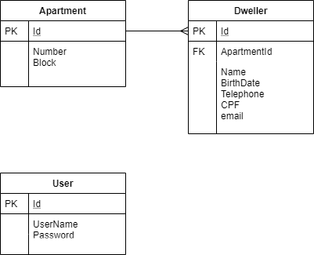

## Desafio Kipper

**Demanda**
Você foi contratado para desenvolver uma aplicação web de ​gestão de condomínio. O seu contratante te forneceu a seguinte orientação: 
“Preciso de um sistema web que me permita realizar o cadastro de apartamentos e os seus moradores. Cada apartamento possui um número, um bloco e vários moradores, sendo que deve ser obrigatório ao menos um morador. 
O morador possui as seguintes informações: Nome completo, data de nascimento, telefone, cpf e e-mail.

Eu devo poder incluir, alterar e excluir livremente os registros de apartamento e moradores.

Deve existir um mecanismo de busca que me permita encontrar todos os moradores de
determinado apartamento, bem como a busca específica por informações do morador.

Deve existir um mecanismo de login e senha para que o sistema possa ser acessado”

**ER**

**mysql**
Executar o script 'database/createdatabase.sql'